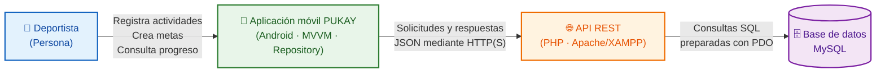

```mermaid
flowchart LR
    D["👤 Deportista<br/>(Persona)"]
    A["📱 Aplicación móvil PUKAY<br/>(Android · MVVM · Repository)"]
    API["🌐 API REST<br/>(PHP · Apache/XAMPP)"]
    DB[("🗄️ Base de datos<br/>MySQL")]

    D -->|"Registra actividades<br/>Crea metas<br/>Consulta progreso"| A

    A -->|"Solicitudes y respuestas<br/>JSON mediante HTTP(S)"| API

    API -->|"Consultas SQL<br/>preparadas con PDO"| DB

    classDef persona fill:#E3F2FD,stroke:#1565C0,stroke-width:2px,color:#0D47A1
    classDef movil fill:#E8F5E9,stroke:#2E7D32,stroke-width:2px,color:#1B5E20
    classDef servidor fill:#FFF3E0,stroke:#EF6C00,stroke-width:2px,color:#E65100
    classDef datos fill:#F3E5F5,stroke:#7B1FA2,stroke-width:2px,color:#4A148C

    class D persona
    class A movil
    class API servidor
    class DB datos
```
  
